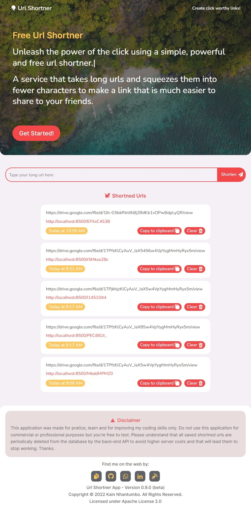

# Url Shortner App

This is a **Url Shortner application** built with React.JS and Typescript that provides a common basic url shortner service. You can find the API source code [here](https://github.com/KainNhantumbo/url-shortner-api).

**Here are some screenshots:**\
\


## Version 0.9.0 (beta)

Has the development goes further I will be listing the introduced and new application features. By now, they are:

- Short long urls, view and delete shortned urls history. This history is saved on localstorage.

- Built from scratch, a custom, beautiful and clean user interface, all built powered with styled-components, and ofcourse, animations (with framer-motion).

## Scripts for testing

Make sure you have installed **Node.js (v16.15.1 or later recommended) and also comes with npm**.\
In the project directory, you can run in terminal:

```bash
 npm run dev
```

Runs the app in the development mode.\
Open [http://localhost:3000](http://localhost:3000) to view it in your browser.

The page will reload when you make changes.\
You may also see any lint errors in the console.

```bash
npm run build
```

Builds the app for production to the **build folder**.\
It correctly bundles React in production mode and optimizes the build for the best performance.

### Disclaimer

This application was made for pratice, learn and for improving my
coding skills only. Do not use this application for commercial or
professional purposes but you're free to test. Please understand that
all saved shortned urls are periodicaly deleted from the database by
the back-end API to avoid higher server costs and that will lead them
to stop working. Thanks.

## Contact

E-mail: [nhantumbok@gmail.com](nhantumbok@gmail.com 'Send an email')\
Github: [https://github.com/KainNhantumbo](https://github.com/KainNhantumbo 'See my github profile')  
Portifolio: [https://portifolio-dev-mu.vercel.app](https://portifolio-dev-mu.vercel.app 'See my portfolio')\
My blog: [https://publish-it-programming.vercel.app](https://publish-it-programming.vercel.app 'Visit my website')

### If you like this project, please consider leaving a star on this repository so I can continue improving this app.

### With kindest regards, Kain Nhantumbo from Mozambique.

## License

Licensed under Apache 2.0 License. All rights reserved.\
Copyright &copy; 2022 Kain Nhantumbo.
